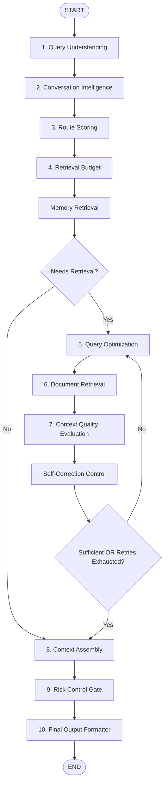

# Enterprise Cognitive Orchestrator

The **Enterprise Cognitive Orchestrator** is a production-grade orchestration engine built using **FastAPI** and **LangGraph**. It acts as an intelligent decision router and context assembler, processing incoming user queries through a structured 10-step cognitive pipeline, executing retrieval routes dynamically, evaluating evidence quality, and controlling safety risks.

---

## Key Features

- **LangGraph StateGraph Routing**: Complete agentic workflow managed via a state-based graph rather than linear loops.
- **10-Step Pipeline**: From query analysis to coreference resolution, multi-route scoring, budget allocation, context quality evaluation, self-correction loops, context assembly, and safety gates.
- **Dynamic Retrieval Budgeting**: Allocates retrieval sources (documents, memory, temporal, conversation) and budgets (`low`, `medium`, `high`) dynamically based on route confidence scores.
- **Self-Correction & Query Expansion Loop**: Re-evaluates quality, expanding retrieval search query semantics dynamically up to a configurable number of retries before requesting user clarification.
- **Robust Local MongoDB Store**: Remembers last conversation turns, topic tracking, and entity transitions.
- **Comprehensive Observability**: Structured logging using `structlog` and request latency metrics tracking.

---

## Core Architecture



---

## State Schema (`OrchestratorState`)

The LangGraph `StateGraph` shares a state object (`TypedDict`) across all steps:

- `query`: The raw user query.
- `session_id`: Unique identifier for the conversation session.
- `tenant_id`: Multi-tenancy isolation key.
- `filters`: Custom filtering metadata.
- `conversation_history`: Extracted history turns from the MongoDB store.
- `query_analysis`: Intent analysis and domain mapping.
- `conversation_state`: Coreference resolution results, summary, and current topic.
- `route_scores`: Scoring matrix for each retrieval route.
- `budget`: Allocated retrieval budget (`top_k`, activated routes).
- `optimized_query`: The rewritten query and semantic variants.
- `memories`: Relevant user-profile decisions or facts.
- `retrieved_chunks`: Evidence chunks fetched from document databases.
- `quality`: Context relevance and coverage evaluation results.
- `retry_count`: Count of active self-correction iterations.
- `needs_clarification`: Set to `True` if retrieval quality is insufficient after maximum retries.
- `context_package`: Assembled tokens-budgeted context payload.
- `risk`: Safety risk control logs (PII detection, prompt injections, coherence checks).
- `output`: The formatted API response payload.
- `step_timings`: Measured latencies for every node in the graph.

---

## Getting Started

### 1. Prerequisites
- **Python**: 3.10+
- **MongoDB**: A running instance (local or replica set).

### 2. Configuration
Create a `.env` file in the project root:
```env
# API Keys
GROQ_API_KEY=your-groq-key
GEMINI_API_KEY=your-gemini-key

# Database Setup
MONGODB_URI=mongodb://localhost:27017/?directConnection=true
MONGODB_DATABASE=orchestrator_db

# Embeddings Config
EMBEDDING_MODEL=all-MiniLM-L6-v2
EMBEDDING_DIMENSION=384

# System Settings
LOG_LEVEL=INFO
MAX_SELF_CORRECTION_RETRIES=2
RISK_CONTROL_ENABLED=true
```

### 3. Install Dependencies
```bash
pip install -r requirements.txt
```

### 4. Run the API Server
Start the FastAPI application with Uvicorn:
```bash
uvicorn main:app --port 8100 --reload
```

Open your browser at `http://localhost:8100/docs` to view the interactive Swagger documentation.

---

## Testing

To run all automated unit and integration tests (including the custom LangGraph node tests):

```bash
pytest
```
